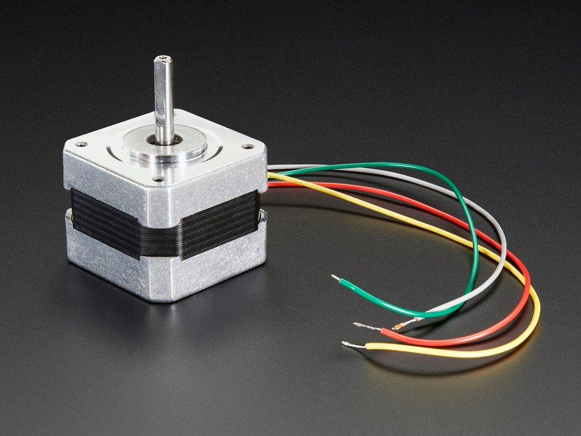

# Tested motor
## NEMA-17 size - 200 steps/rev, 12V 350mA

* 200 steps per revolution, 1.8 degrees 
    * Adafruit_StepperMotor *myMotor = AFMS.getStepper(200, 1);
* Coil #1: Red & Yellow wire pair. Coil #2 Green & Brown/Gray wire pair.

### Images 

### 테스트 영상

https://youtu.be/72XpgnHryAs

# References
* https://www.adafruit.com/product/324
* https://archive.is/JJWC8
